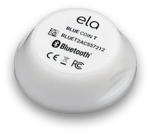

# BLE sensors

Supported temperature sensors - these appear in the list of found sensors.

## ELA BlueCoinT

The ELA BlueCoinT is an industrial BLE temperature sensor from [ela innovation](https://elainnovation.com/en/product/blue-coin-t-en/). They are not cheap (€31), but are waterproof (not hot tub proof though, sorry). It is sealed and had battery build in - non changable.

I purchased some of these direct from ELA, and they arrived and were announcing temperature via BLE.

It appears with the name as printed on it, usually somethiung like `C T 802B03`, though the app allows this to be changed.

**However** I ordered some from Amazon and they were not advertising. I had to download the app and *activate* via NFC - which was very tricky as the sensor is small, so has to be in just the right place by the top of my phone.

## Telink  sensors (e.g. Mi Temperature and Humidity Monitor 2)

It seems there are a lot of very cheap sensors (£9), even with displays. Amazon sell the [Mi Temperature and Humidity Monitor 2](https://www.amazon.co.uk/dp/B08C7KVDJW).

These sensors seem to require an app, and then to be activated. The app needs a login, I nearly did not add them at all. However, it seems someone has done some customer firmware and it is easy to reflash!

The instructions are [here](https://github.com/pvvx/ATC_MiThermometer#flashing-or-updating-the-firmware-ota) and pretty easy to follow. You go to a [web page](https://pvvx.github.io/ATC_MiThermometer/TelinkMiFlasher.html), select `Connect` and find the sensor (e.g. `LYWSD03MMC`), select `Activate`, then `Custom Firmware`, then `Start flashing`. Simple as that, takes a few minutes.

You can reconnect (it changes its name to start `ATC_...`) but then you have loads of options.

The default `custom format` advertisement is understood. The device will appear with its MAC address as its name.