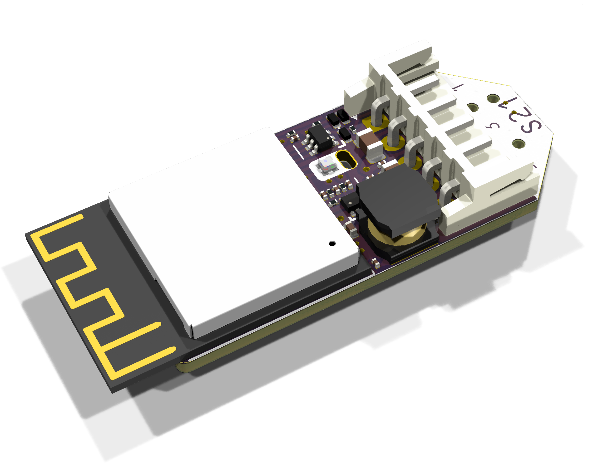
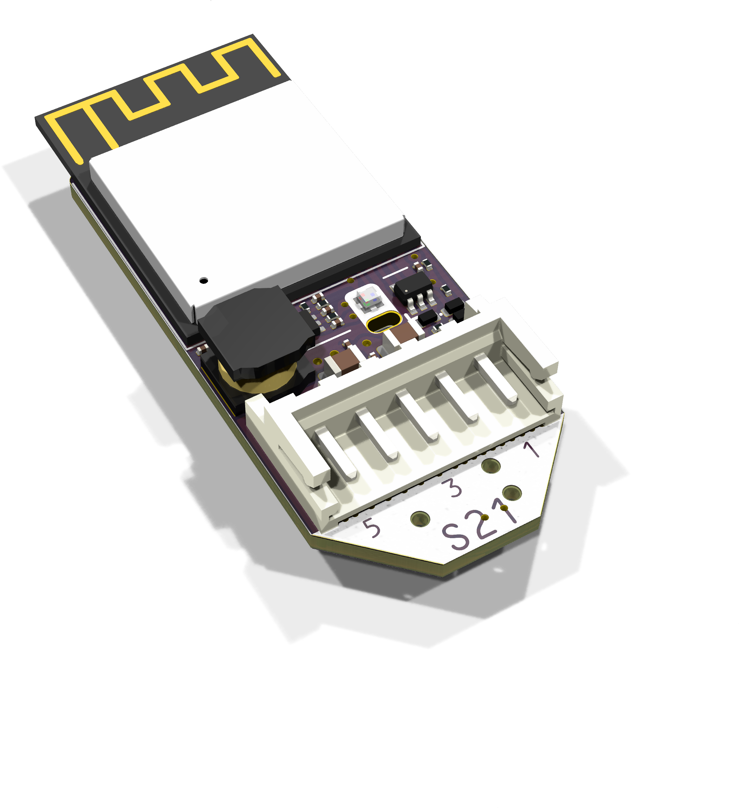
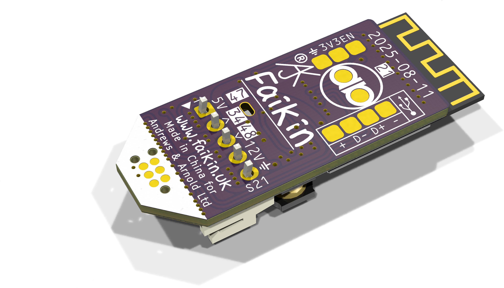

# PCB

These files are for use in [KiCad](https://www.kicad.org) so can be edited as needed.

You should, technically, remove the A&A and AJK logos as they are trademark. If you are using for yourself, then fine, but you must not trade (i.e. sell boards you make) with these logos.

## Ordering

There are also `production` files for [JLCPCB](https://jlcpcb.com)

When ordering, you need the `gerber.zip`, `bom.csv`, and `position.csv` files.
