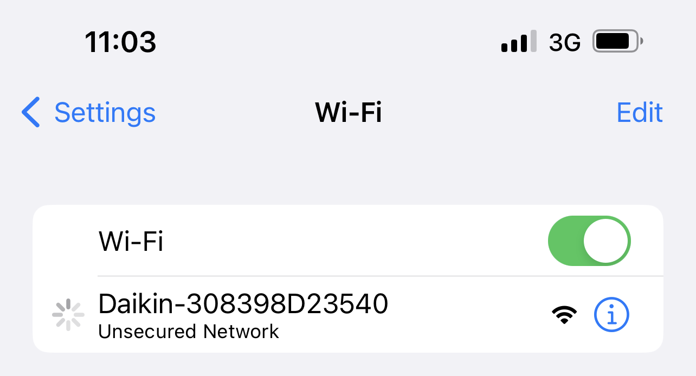
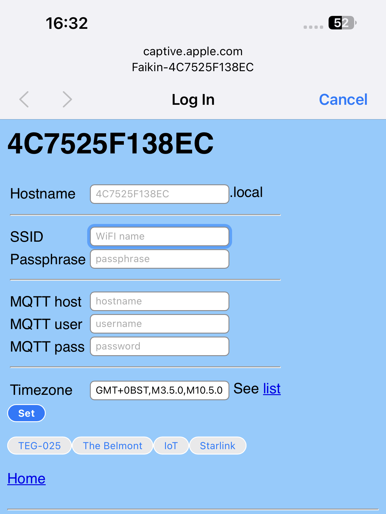

# ESP32-Faikin

Everyone knows Daikin make some of the best air conditioners out there, mechanically speaking. Sadly their WiFi control modules are not so good, especially the latest models which are all cloud based, require an internet connection to even work, and are slow.

This code provides local control via web interface, MQTT, and HomeAssistant integration, all with no cloud crap.

Wiki: [List of supported air-con](https://github.com/revk/ESP32-Faikin/wiki/List-of-confirmed-working-air-con-units) **Please update this with your model**

PCB designs are included, and also available to buy on [Amazon UK](https://www.amazon.co.uk/dp/B0C2ZYXNYQ). Note, whilst Amazon have done some export, some people have used a parcel forwarder for non UK, such as [Forward2Me](https://forward2me.com).

## Why I made this

The history is that, after years of using Daikin air-con in my old home, and using the local http control, in my new house in Wales the WiFi was all cloud based with no local control, and useless, and slow. Just configuring it was a nightmare. I spent all day reverse engineering it and making a new module to provide local control. Pull requests and feature ideas welcome.

# Set-up

Appears as access point with simple web page to set up on local WiFI. On iPhone the setup page auto-loads.

# Operation

Local interactive web control page using *hostname*.local, no app required, no external internet required.

- [Setup](Manuals/Setup.md) Manual
- [Controls](Manuals/Controls.md) Manual
- [Advanced](Manuals/Advanced.md) Manual

# Design

* KiCad PCB designs included, with JLCPCB production files.
* 3D printed case STL files
* Documentation of reverse engineered protocol included

Basically, Daikin have gone all cloudy with the latest WiFi controllers. This module is designed to provide an alternative.

* Simple local web based control with live websocket status, easy to save as desktop icon on a mobile phone.
* MQTT reporting and controls
* Works with Home Assistant over MQTT
* Includes linux mysql/mariadb based logging and graphing tools
* Works with [EnvMon](https://github.com/revk/ESP32-EnvMon) Environmental Monitor for finer control and status display
* or, works with BlueCoinT BLE temperature sensor as a remote reference in an auto mode
* Automatically works out if S21 or X50 protocol (used on bigger/ducted units0
* Backwards compatible `/aircon/get_control_info` and `/aircon/set_control_info` URLs

# Building

Git clone this `--recursive` to get all the submodules, and it should build with just `make`. There are make targets for other variations, but this hardware is the `make pico` version. The `make` actually runs the normal `idf.py` to build with then uses cmake. `make menuconfig` can be used to fine tune the settings, but the defaults should be mostly sane. `make flash` should work to program. You will need a programming lead, e.g. [Tazmotizer](https://github.com/revk/Shelly-Tasmotizer-PCB) or similar, and of course the full ESP IDF environment.

If you want to purchase an assembled PCB, see [A&A circuit boards](https://www.aa.net.uk/etc/circuit-boards/) or [Amazon](https://www.amazon.co.uk/dp/B0C2ZYXNYQ).
